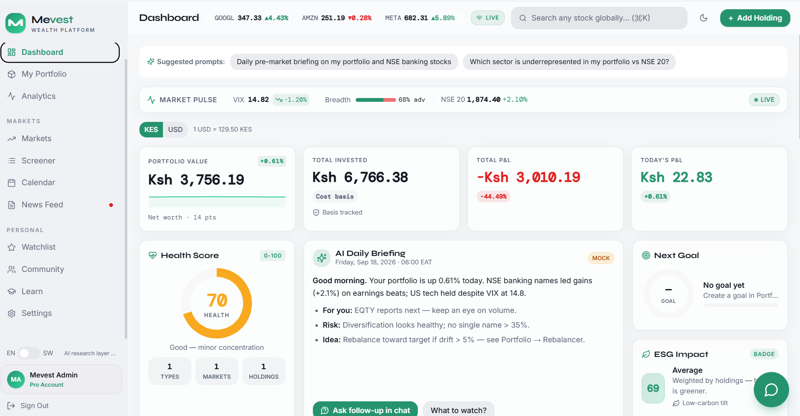
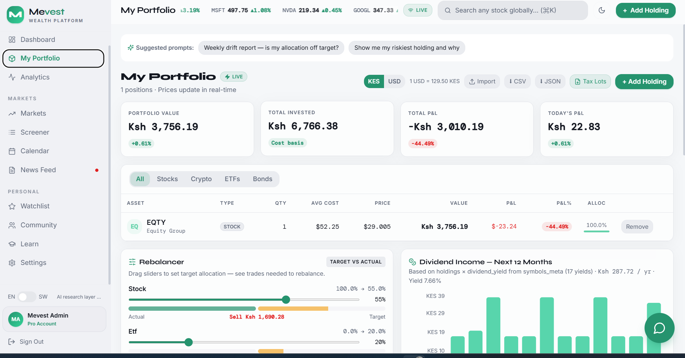
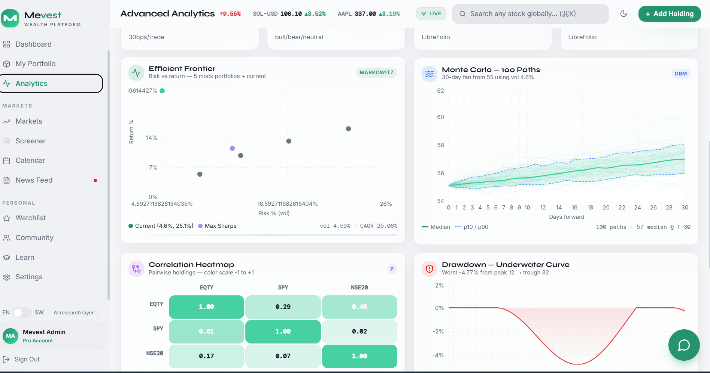
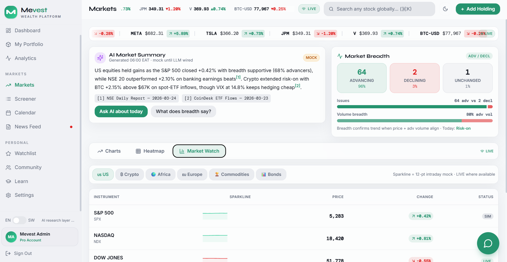
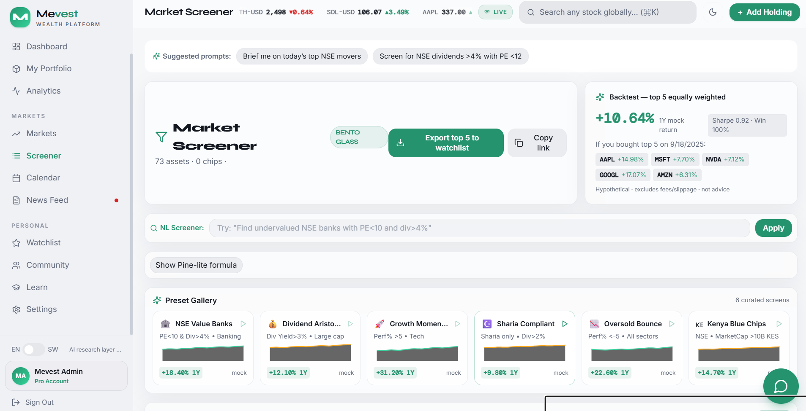
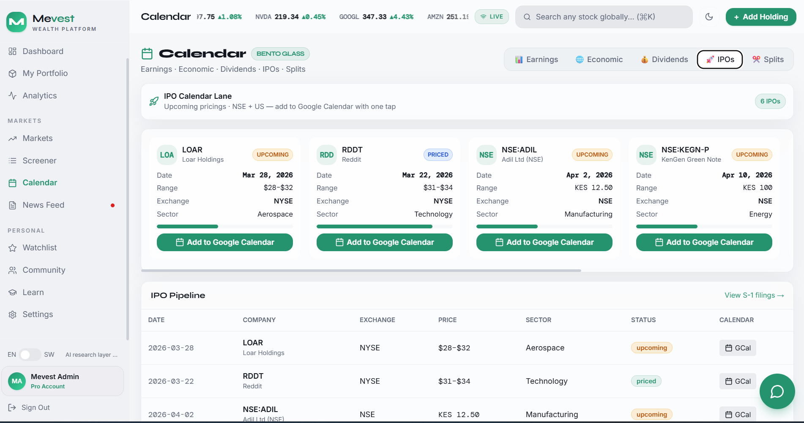
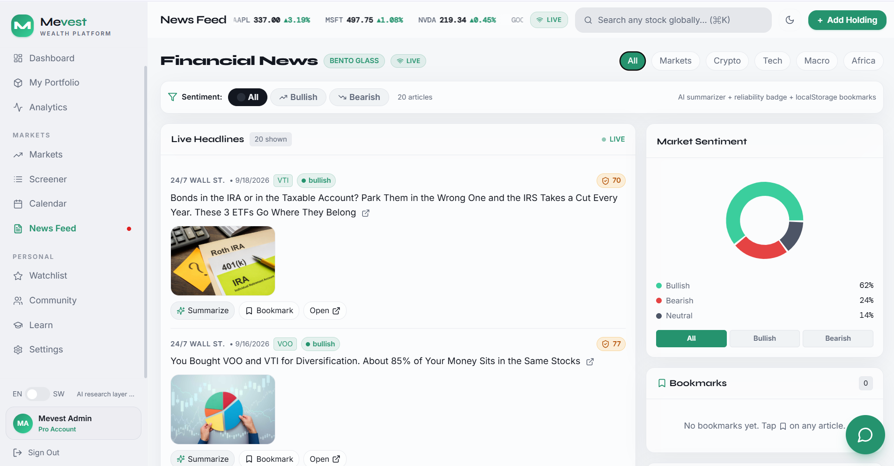
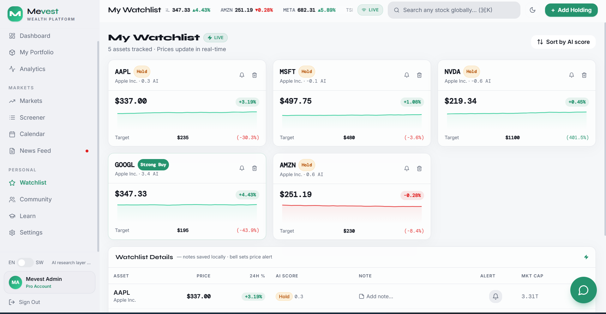
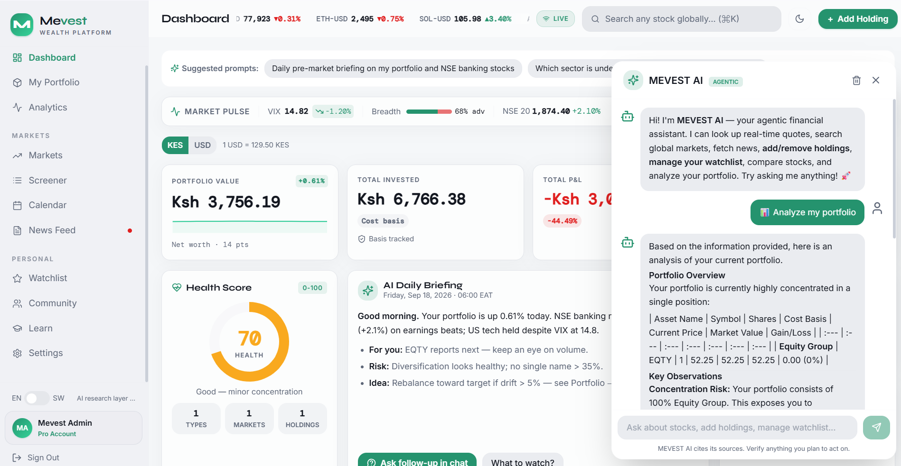

# MEVEST — AI-Native Africa + Global Investing Platform

> **The AI research layer for the African + global retail investor that Google Finance forgot to build.**

[](https://yourusername.github.io/mevest-africa-vault/) [](#-production-build--deployment) [](#-testing) [](#-available-scripts) [](#-pwa) [](#-license)

A premium, real-time wealth management platform built with **React 18**, **TypeScript**, **Tailwind CSS v3.4**, **Recharts**, **Framer Motion**, and **Supabase** (Lovable Cloud). MEVEST fuses global coverage (US, EU, crypto) with genuine **NSE depth** — the one market none of US giants serve well — plus a **cited, proactive AI** that's honest about its sources. KES-first, M-Pesa-aware, Swahili-ready, and offline-capable as a PWA.

**🎭 Try the Live Demo:** Experience MEVEST without any setup! The demo includes realistic sample data featuring NSE stocks (Safaricom, Equity Bank, KCB), global equities (Apple, NVIDIA), and cryptocurrencies (Bitcoin). All features are fully functional including portfolio analytics, market screening, AI insights, and more.

---

## 📸 Screenshots

### Dashboard - Your Daily Investor Home


The main dashboard features a bento grid layout with:
- **Portfolio Stats Cards**: Real-time portfolio value with sparkline trend, invested amount, P&L, and today's change
- **Health Radial**: 0-100 score based on diversification metrics (holdings count, asset types, markets, P&L performance)
- **AI Daily Briefing**: Contextual insights with follow-up prompts
- **Goals Progress Ring**: Track investment goals with M-Pesa framing
- **Market Pulse Strip**: Live VIX, market breadth, and NSE indicators
- **Performance Charts**: Area chart showing portfolio value over time
- **Holdings Table**: Interactive table with flash animations for price changes
- **Top Movers**: Gainers and losers with LIVE pulse indicators

### My Portfolio - Complete Position Management


Comprehensive portfolio management with:
- **Rebalancer Widget**: Visual target vs actual allocation sliders with buy/sell recommendations
- **Dividend Projection**: 12-month seasonalized bar chart using real dividend yields
- **What-If Simulator**: Calculate impact of additional investments on portfolio yield
- **Fees Tracker**: Donut chart breakdown by fee type with TER slider
- **Goals Tracker**: Progress bars with M-Pesa micro-investment framing
- **Natural Language Import**: Type "20 SCOM at 28 KES" to add holdings instantly
- **Tax Lot Export**: FIFO-based CSV export for tax reporting

### Advanced Analytics - Institutional-Grade Analysis


Professional analytics suite including:
- **12 KPI Cards**: CAGR, Sharpe Ratio, Sortino, Calmar, Volatility, Max Drawdown, Beta, TWRR, Cost-Adjusted Sharpe, Regime Label, FIFO/WAC Avg Cost
- **Efficient Frontier**: Scatter plot showing optimal portfolios vs current position
- **Monte Carlo Simulation**: 100-path GBM fan with p10/p50/p90 confidence bands
- **Correlation Heatmap**: N×N matrix with color-coded correlation coefficients
- **Drawdown Underwater Chart**: Visual representation of peak-to-trough declines
- **Factor Exposures**: Market, Size, Value, Momentum, Quality factor analysis
- **Download CSV Report**: Export complete analytics report

### Markets - Supercharts Lite with Live Intel


Advanced market visualization with:
- **Infinite Ticker Tape**: Scrolling ticker with live prices
- **Interactive Charts**: Candlestick charts with MA, BB, RSI overlays
- **Comparison Overlay**: Normalize and compare two assets with Pearson correlation
- **2-Chart Mode**: Side-by-side comparison with independent quotes
- **Market Breadth**: Advance/decline ratio visualization
- **AI Market Summary**: Cited analysis of market movements
- **Heatmap**: Sector treemap sized by market cap, colored by performance
- **Market Watch Table**: Sparklines for each tracked asset

### Screener - Natural Language + Pine-Lite Formulas


Powerful screening capabilities:
- **Natural Language Input**: "Find undervalued NSE banks with PE<10 and div>4%"
- **Pine-Lite Formula Bar**: `SMA(close,20) > SMA(close,50) AND RSI(14) < 70`
- **Advanced Filters**: Market cap, PE ratio, dividend yield, performance ranges
- **Sharia Compliance Filter**: Ndovu-inspired Islamic finance screening
- **Preset Gallery**: Pre-built screens (NSE Value Banks, Dividend Aristocrats, etc.)
- **Backtest Top-5**: Simulate 1-year returns for top screened stocks
- **Bulk Export**: Save top results to watchlist

### Calendar - Regional Research & Events


Comprehensive event calendar with:
- **Earnings Lane**: Live earnings dates with audio stub, AI highlights, transcripts
- **Dividends Lane**: NSE book-closure dates with filing PDFs and alert buttons
- **Economic Events**: Impact-filtered economic calendar with Google Calendar sync
- **IPO Lane**: Upcoming IPOs with countdown timers
- **Splits Lane**: Stock split and bonus issue tracking
- **Ex-Div Countdown**: Progress ring showing days until ex-dividend date

### News Feed - Real-Time with Sentiment Analysis


Intelligent news aggregation:
- **Sentiment Filter**: All/Bullish/Bearish filtering using FinBERT
- **AI Summarizer**: One-sentence summaries per article
- **Source Reliability**: 0-100 reliability scores (Bloomberg 92, Reuters 94)
- **Category Filter**: General, Crypto, Tech, Forex, Earnings
- **Bookmarks**: Save articles to localStorage sidebar
- **Trending Symbols**: Most mentioned tickers in news

### Watchlist - Starred Assets with AI Scores


Smart watchlist management:
- **Live Price Updates**: Real-time price changes with sparklines
- **Price Alerts**: Inline bell icon for setting price alerts
- **Notes Column**: Editable notes per symbol
- **AI Score**: Strong Buy/Buy/Hold/Sell/Strong Sell badges
- **Sort by AI Score**: Prioritize by algorithmic recommendation
- **Remove Button**: Quick removal from watchlist

### AI Chat Widget - Cited Agentic Assistant


Advanced AI assistant with:
- **11 Tools**: Search, quotes, charts, news, portfolio management
- **Agentic Loop**: 5-iteration maximum for complex queries
- **Citation Policy**: Every claim cites source with timestamp
- **Streaming Responses**: Real-time SSE streaming
- **Quick Actions**: Pre-built prompts for common tasks
- **Portfolio Integration**: Direct access to holdings data
- **Tool Status**: Shows which tools are being used

---

## 🚀 Quick Start - Try the Demo

### Option 1: Live Demo (No Setup Required)
Visit the live demo at **[https://Jack-ki1.github.io/MEVEST/](https://Jack-ki1.github.io/MEVEST/)** to experience MEVEST immediately with realistic sample data.

### Option 2: Run Locally
```bash
# Clone the repository
git clone https://github.com/Jack-ki1/MEVEST.git
cd mevest-africa-vault/frontend

# Install dependencies
npm install

# Start development server
npm run dev
# → http://localhost:8080
```

The app will automatically detect that Supabase is not configured and activate **Demo Mode** with sample portfolio data.

---

## 🏗️ Architecture

```
┌──────────────────────────────────────────────────────────────┐
│                    Frontend (React 18 + Vite 5)              │
│  ┌──────────┐ ┌──────────┐ ┌──────────────────────────────┐  │
│  │  12 Pages│ │ 20+ Comp │ │ Contexts: Auth/Portfolio/    │  │
│  │  Bento + │ │ Glass +  │ │ Watchlist/Market/Currency/   │  │
│  │  Motion  │ │ Recharts │ │ Language/Theme/Demo          │  │
│  └──────────┘ └──────────┘ └──────────────────────────────┘  │
│           │          │              │                        │
│           └──────────┼──────────────┘                        │
│                      ▼                                       │
│          ┌──────────────────┐                                │
│          │ Supabase Client  │  frontend/src/integrations/    │
│          │  + Realtime      │  supabase/client.ts            │
│          └────────┬─────────┘                                │
│                   │                                          │
│            Demo Mode Fallback                                │
│            (Mock Data when                                   │
│             Supabase unavailable)                            │
└───────────────────┼──────────────────────────────────────────┘
                    ▼
┌──────────────────────────────────────────────────────────────┐
│            Supabase (Postgres 15 + Auth + Realtime + Fns)   │
│  ┌────────────┐ ┌───────────┐ ┌──────────────────────────┐   │
│  │  Database  │ │   Auth    │ │  9 Edge Functions (Deno) │   │
│  │  22 tables │ │ JWT/RLS   │ │  Realtime postgres_changes│   │
│  └────────────┘ └───────────┘ └────────────┬─────────────┘   │
│         │                           │       │                 │
│         ▼                           ▼       ▼                 │
│  ┌────────────┐        ┌───────────────────┐  ┌────────────┐ │
│  │   RLS      │        │  Yahoo Finnhub    │  │ AI Gateway │ │
│  │  Policies  │        │  TwelveData →NSE  │  │ Gemini/    │ │
│  └────────────┘        │  market-sync cron │  │ OpenAI/    │ │
│                        └───────────────────┘  │ HF FinBERT │ │
│                                               └────────────┘ │
└──────────────────────────────────────────────────────────────┘
```

**Data flow v2:** `market-sync` (Finnhub → TwelveData → Yahoo, every 5 min) → `price_history` (Postgres, `latest_prices` MV) → `supabase Realtime` → `RealtimeMarketContext` (no polling `O(symbols)` vs `O(users)`) → UI. `sentiment-sync` (HF `ProsusAI/finbert`) enriches `news_cache` → `Key Moments` + badges.

**Demo Mode:** When Supabase is unavailable (GitHub Pages deployment), the app seamlessly falls back to realistic mock data via `DemoContext`, allowing full feature exploration without backend dependencies.

---

## 🛠️ Tech Stack

| Layer | Technology |
|-------|------------|
| Frontend | React 18.3, TypeScript 5.8, Vite 5.4, React Router 6.30 |
| Styling | Tailwind CSS v3.4, shadcn/ui (Radix), **Framer Motion 12**, `tailwindcss-animate`, **Glassmorphism bento** (`bg-card/70 backdrop-blur-xl`) |
| Charts | **Recharts 2.15** + planned `lightweight-charts` (TradingView OSS) |
| State | React Context API (8 contexts: Auth, Portfolio, Watchlist, RealtimeMarket, Currency, Language, Theme, Demo), TanStack React Query 5.83 |
| Backend | Supabase — Postgres 15, Auth, Realtime (`postgres_changes`), 9 Edge Functions (Deno) |
| AI | Gemini 1.5 Flash / OpenAI / OpenRouter via `ai-insights` (11 tools, 5-iteration agentic loop) + HF `ProsusAI/finbert` via `sentiment-sync` |
| Market Data | Yahoo Finance (primary proxy) → Finnhub (60 req/min) → Twelve Data (800/d) → NSE Delayed Data (15 min, licensed vendor planned) |
| PWA | `frontend/public/manifest.webmanifest` + `frontend/public/sw.js` (shell cache, stale-while-revalidate) |
| Testing | Vitest 3.2 + jsdom, Testing Library, Playwright 1.57 |
| Deployment | GitHub Pages (static demo), Vercel/Netlify (full stack), Docker (local Supabase) |
| Tooling | ESLint 9, TypeScript ESLint, Autoprefixer, `vite-plugin-react-swc`, gh-pages |

---

## 🎨 Design Principles (2026)

Borrowed from Mercury (calm is credibility), Stripe (tables + sparklines), Revolut (dark legibility), Apple's Liquid Glass, and Bento dashboards: **glass + bento + motion** everywhere. Every page is `grid grid-cols-12` bento, `GlassCard` (`backdrop-blur-xl`), `motion` hover `y:-2`. Dark/light/system theme, tabular numerals, right-aligned figures, inline sparklines.

**Key Design Elements:**
- **Glassmorphism**: `bg-card/70 backdrop-blur-xl border-border/50 rounded-xl shadow-[0_4px_24px_hsl(var(--foreground)/0.04)]`
- **Bento Grid**: 12-column responsive grid system
- **Motion**: Framer Motion spring animations (`y:-2 scale:1.005` on hover)
- **Typography**: Tabular numerals for financial data, right-aligned numbers
- **Color System**: Dynamic primary color via CSS variables (customizable in Settings)
- **Responsive**: Mobile-first with max-md breakpoints

---

## 🗂️ What Each Section Offers

### 📊 Dashboard (`/dashboard`)
Your daily investor home. Bento 12-col:

| Card | What it does | Creative twist |
|------|--------------|----------------|
| **Stats 4×3** | Portfolio Value (with **14-pt sparkline**), Invested, P&L, Today's P&L — KES/USD toggle (`useCurrency`) | Sparkline is live `totalVal` drift, not static |
| **Health Radial** | 0-100 donut (48 + holdings×5 + types×6 + markets×4 + PL bonus) | Green≥80/Amber≥55/Red — `framer-motion` spring |
| **AI Daily Briefing** | Mock 06:00 EAT: portfolio delta, NSE banks +2.1%, rebalance idea. 2 CTAs: `Ask follow-up in chat` → `AiChatWidget`, `What to watch?` | Future: generated by `run-briefings` cron |
| **Goals Ring** | Next `investment_goals` donut + bar (`investment_goals` table) | M-Pesa framing |
| **Market Pulse strip** | VIX, breadth 68% adv, NSE 20 live | `MARKET_REGIONS` live |
| **ESG Badge** | 62 + holdings×3, Leader/Average/Laggard, leaf icon, low-carbon tilt | Sector-weighted mock |
| **Performance** | Current value `AreaChart` + **Cash-flow mini bar** (6M inflow vs outflow) | Net KES caption |
| **Allocation** | Pie `inner 30 outer 48` by `type` | Hover `Tooltip` % |
| **Movers** | Top Gainers/Losers (5 each, live `chgPct`) + Sector Performance 1D bars | `LIVE` pulse dot |
| **Holdings** | Table with flash `price-up/down`, stale badge | RLS `holdings` |
| **Suggested Prompts** | `SuggestedPrompts page="dashboard"` — 2 one-click briefing creates | Google Tasks pattern |
| **Prediction + Gov** | `PredictionEmbed` (Polymarket) + `GovTrackerMock` (Parliament disclosures) | Perplexity virality |

### 💼 My Portfolio (`/portfolio`)
*All positions, now bento:*

- **Header:** `SuggestedPrompts page="portfolio"`, `LIVE` badge, KES/USD toggle, Import (CSV/image + **nat-lang parse** `"20 SCOM at 28 KES"` via `PortfolioImportWizard.tsx:58`), `⬇ CSV/JSON`, `+ Add Holding`.
- **Stats** 4× glass cards + sparkline.
- **Holdings table** — flash, stale `amber` badge, Remove.
- **Rebalancer Widget** — actual % by `type` vs target sliders (55/20/15/10). Dual bars (actual `primary/70` vs target `amber/60`) + `Buy/Sell KES X` per type, drift total, Reset. *Stripe/Brex density.*
- **Dividend Projection** — fetches `symbols_meta.dividend_yield` (fallback `MARKET.divYield`), `annual = shares*price*yield`, seasonalized 12M `BarChart` + annual total & yield% in `formatWithCurrency`.
- **What-If Simulator** — input KES + symbol select → `addedShares = amt/price` (KES↔USD via `usdKes`), new total, new annual div & yield, before/after alloc table. *Blankly one-line switch vibe.*
- **FeesTracker** `frontend/src/components/FeesTracker.tsx:1` — donut by `fee_type` (`fees_ledger` table), TER drag `fees/totalVal%`, ledger list. *Wealthfolio pattern.*
- **GoalsTracker** `frontend/src/components/GoalsTracker.tsx:1` — progress bar, `+ KES 1,000 via M-Pesa (mock)` per goal (`investment_goals`). *Ziidi KES 1 min.*
- **Exports:** `exportCSV`, `exportJSON`, **Export tax lots** (FIFO CSV, `FileDown`).

### 📈 Advanced Analytics (`/analytics`)
*From "Awaiting…" to institutional-grade:*

- **12 KPIs bento** (staggered `delay i*0.04`): CAGR, Sharpe (`rf = T-Bill 91`), Sortino, Calmar, Volatility, Max DD, Beta, **TWRR**, **Cost-Adj Sharpe** (30bps/trade), **Regime** (`bull/bear/neutral` via `extendedMetrics.regimeLabel`), **FIFO Avg Cost**, **WAC Avg Cost** (from `transactions` table). + `RatesComparator` + **Download CSV Report** (TradingView pattern).
- **Efficient Frontier** — `ScatterChart` risk% vs return% (5 mock: Conservative, Max Sharpe purple, Balanced, Growth, Aggressive + current `vol*100` vs `cagr*100` green).
- **Monte Carlo 100 Paths** — 30-day GBM fan from `closes[last]` using `dailyVol=vol/√252`, `Box-Muller randn()`, 100 faint lines + p10/p50/p90. Median `T+30` caption.
- **Correlation Heatmap** — `N×N` matrix (or `sym/SPY/NSE20` when single holding) via `pseudoCorr` hash, `-1 red → +1 green`, `motion scale` per cell, color legend.
- **Drawdown Underwater** — `(c-peak)/peak*100` `AreaChart` gradient red.
- **Factor Exposures** — vertical `BarChart` Market (beta), Size 0.32, Value -0.18, Momentum 0.47, Quality 0.21 (diverging HSL, domain `[-1,1.5]`).
- Source: `frontend/src/lib/analytics/riskMetrics.ts:1` + `frontend/src/lib/analytics/extendedMetrics.ts:1` (twrr, fifo/wac, `withTransactionCosts`, `regimeLabel`), live `price_history` + `kenya_rates` risk-free.

### 🕯️ Markets (`/markets`)
*Supercharts lite (TradingView) + live intel:*

- **Ticker Tape** — infinite `motion x -33.33% 40s` triplicated `tickerItems`/`TICKER_ITEMS`, `LIVE/SIM` badge, edge fades.
- **Tabs:** Charts / Heatmap / Market Watch (Bento glass).
- **ChartsTab:** Search + range `1D|1W|1M|3M|1Y|5Y` + overlay `none|MA 20/50|volume|BB|RSI(14)` via `frontend/src/lib/analytics/indicators.ts:1` (sma/ema/rsi/bollinger), **Compare overlay** (second search → purple normalized line, Pearson + Δ% badge, raw/normalized toggle), **2-chart toggle** (side-by-side second `AreaChart` with own quote), **NSE indicative banner** for `.NR` + **Alert** (Bell → `PriceAlertModal` with webhook/multi/watchlist). `Recharts` `AreaChart/ComposedChart` with gradients.
- **AI Market Summary** — 2-sentence pre-written (S&P +0.42% breadth 68%, NSE +2.10%; BTC +2.15% >$67K) with `[1][2]` citations (NSE Daily Report, CoinDesk).
- **Market Breadth** — adv/decl/unch counts + `volAdvPct` stacked bars, Risk-on/off.
- **Market Watch Table** — region `us/crypto/africa/europe/commodities/bonds` + **Sparkline column** (`SparklineCell` 72×28 `AreaChart` per row, green/red).
- **HeatmapTab** — sector treemap (sized by `√mktcap`, colored by `chg`) + `colorForChg` scale.

### 🔍 Screener (`/screener`)
*From 3 text filters to a real instrument:*

- **NL Screener box** (Perplexity pattern) — input `'Find undervalued NSE banks with PE<10 and div>4%'` → regex maps to `Filters` (pe max, div min, NSE, Banking, Sharia). `Apply` hydrates filters + toast.
- **Pine-lite formula bar** (TradingView pattern) — `SMA(close,20) > SMA(close,50) AND RSI(14) < 70` → `frontend/src/lib/pineLite.ts:1` (`evaluatePineLite` with `sma`/`rsi` last values) filtered client-side.
- **Advanced filters** — `FreeText` Type/Exchange/Sector + `NumFilter` MktCap/PE/Div Yield/Perf% (min-max) + **Sharia only** checkbox (Ndovu insight).
- **Presets:** `screener_presets` table + **Preset gallery** 6 cards with sparkline (`NSE Value Banks`, `Dividend Aristocrats`…) + `applyPresetGallery`, bulk `Save` (bookmark) + `Copy-filter-link` (base64).
- **Backtest top-5** — deterministic mock 1Y return `8+chg*2.5+div*0.8-(pe-15)*0.3`, avg/Sharpe/win-rate ("if you bought top 5 equally weighted 1Y ago").
- **Table** — `* # Asset Type Price 24h% Exchange Sector` + star (watchlist) + globe (live) + Load 30 more + **Export top-5 to watchlist**.

### 🗓️ Calendar (`/calendar`)
*Regional research: Mali's dividend book-closure + Google live earnings + TradingView premarket:*

- **Tabs:** Earnings / **Dividends (NSE)** / Economic — `bg-secondary` pill.
- **Earnings lane** — summary cards (This Week/Next Week/Avg EPS Growth/Beat Rate 78%) + **Earnings table** (Date/Time/Company/EPS Est/Prior/Rev Est/Prior/Surprise) + **Earnings Audio stub** (▶ Play live call toast) + **AI Highlights** (2 bullets: KCB Q3 beat 4%, Safaricom M-Pesa +12% YoY) + transcript placeholder.
- **Dividends lane** — `corporate_actions` (`dividend`/`book_closure`) + **Holdings highlighted** amber, `Filing PDF` link (`news_cache`), **Alert 3d before** button (creates `price_alerts`), **Premarket only** filter (NSE 09:30 EAT), progress ring for ex-div countdown.
- **Economic lane** — impact filter `all|high|medium|low` + table (Date/Time/Country/Event/Impact/Forecast/Previous) + `googleCalendarUrl()` `TEMPLATE` per row.
- **IPO lane** — 6 mock IPOs (NSE:ADIL etc.) bento cards + pipeline table + Google Calendar.
- **Splits lane** — 5 splits/bonus cards + ratio hero.

### 📰 News Feed (`/news`)
*Real-time with HF FinBERT & reliability:*

- **Feed:** `market-news` (general/crypto/tech/forex/earnings + ticker-specific) + fallback `MARKET` mock. 45+ exchanges.
- **Sentiment Filter** All/Bullish/Bearish (FinBERT) + category `general|crypto|tech|forex|earnings`.
- **AI Summarizer** per article (450ms mock 1-sentence toggled), **Source reliability** badge 0-100 (Bloomberg 92, Reuters 94… hash fallback), **Bookmark** `localStorage['mevest_news_bookmarks']` + sidebar list + trending symbols.

### ⭐ Watchlist (`/watchlist`)
*Starred assets with AI & notes:*

- **Cards + Table** with `LIVE` badge, sparkline (recharts mini Area), price + change, remove.
- **Price alerts inline** Bell/BellRing per row → modal (`target` + `above|below`, `localStorage mev_alerts`).
- **Notes column** editable textarea per symbol (`localStorage mev_notes`, card preview with StickyNote).
- **AI Score** deterministic `chgPct*0.6+hash(sym)` → Strong Buy/Buy/Hold/Sell/Strong Sell badge + numeric, **Sort by AI score** toggle. *TradingView Copilot quiz vibe.*

### 👥 Community (`/community`)
*TradingView Ideas + verified track records:*

- **Leaderboard** opt-in pseudonymous, computed from `portfolio_snapshots` (never self-reported), **tiers** Gold≥15%/Silver≥5%/Bronze (Crown/Medal/Trophy) glass card, `Copy top 3 holdings` to clipboard.
- **Ideas Stream** — list `ideas` (symbol pill + title + body + sentiment), `💡 Publish Idea` modal (symbol/title/body → `ideas` table, auth required), collapsible **Comments thread** (mock seeded + add + likes `ThumbsUp` count), like/comment per idea.
- Filter `nse|us|blended` (future: weights-on-click, not cost basis).

### 🎓 Learn (`/learn`)
*Financial literacy = retention (none of Big 3 does this):*

- **4 modules** (3-5 min each): Book-closure date, T-Bill vs MMF vs Stocks (→ `RatesComparator`), P/E ratio (→ `Screener`), Diversification (→ `Analytics` Beta). Each ends in quiz (3 questions) → badge (`learning_progress` table).
- **Interactive calculators tabs**: **Compound** (principal/rate/years → FV + Area), **Retirement** (current/retire/monthly/rate → FV), **Mortgage** (principal/rate/years → monthly/total/interest + bar). Live result + chart.
- **Gamification:** XP bar `completed*25`, Level, **Streak** `mev_streak` weekly dots + Flame, **Certificate modal** after 4 modules (Award, copy link).
- Tie-ins drive feature discovery.

### ⚙️ Settings (`/settings`)
*Production-grade + playground:*

| Tab | Icon | What it offers |
|-----|------|----------------|
| **Profile** | User | Display name, email (locked), base currency (8 options), timezone (6), Save/Reset, Sign Out → `profiles` upsert |
| **Notifications** | Bell | 6 alert types (Price/Dividends/Breaking/Drift/Bond/FX) + 2 reports (Weekly/Monthly) → `user_settings` JSON |
| **AI Briefings** | Bell | Nat-lang `"Send me daily pre-market briefing..."` + cron `0 6 * * 1-5` + delivery `in_app|email|whatsapp` → `scheduled_briefings` (WhatsApp = Kenya moat, 90%+ penetration) + `run-briefings` cron. *Google Tasks parity + WhatsApp edge.* |
| **Data Sources** | Key | Built-in `Yahoo Finance` + `MEVEST AI` active + 5 third-party (Alpha Vantage/CoinGecko/NewsAPI/Polygon/Custom) testUrl + RLS `user_api_keys` + masked reveal + `Test Connection` (CORS-aware) |
| **Security** | Shield | 2FA `Coming soon` (preference only), Login Alerts toggle, Session Timeout, Change Password → `supabase.auth.resetPasswordForEmail` |
| **Billing** | CreditCard | Pro $29/mo, usage (API Calls 1,247/10k, Data Points 48k/100k, Portfolios 3/∞) |
| **API Playground** | FlaskConical | Live `marketApi.getQuotes` / `search` (`Try it` → JSON viewer + Copy). *Perplexity `finance_search` pattern.* |
| **Export Data** | Download | Bundles holdings + watchlist + alerts/notes → `mevest-export-YYYY-MM-DD.json` (mock ZIP). Counts. |
| **Appearance** | Palette | **Theme builder** color picker `mev_primary` → CSS `--primary` live, swatches, preview card (buttons, bar, LIVE pill). *Finvizity.* |

Plus: **Sidebar** `frontend/src/components/layout/Sidebar.tsx:12` — 3 groups (Portfolio/Markets/Personal), active `primary/12`, **EN/SW toggle** (`LanguageContext` `en|sw`, tagline `AI research layer…`), Pro badge, Sign Out. **Topbar** — search, add-holding, menu. **AI Chat** `AiChatWidget.tsx:35` — floating, streams markdown, citation chips `[$1]` → `primary/15` pill, **cited sources drill-down**, `mevest-ask-followup` hook from Briefing, footer `MEVEST AI cites its sources. Verify anything you plan to act on.`

---

## ✅ Prerequisites

| Requirement | Version | Notes |
|-------------|---------|-------|
| Node.js | `v24.21.0` (or >=18) | `node -v` |
| npm | `11.19.0` (or >=9) | `npm -v` |
| Supabase CLI | `2.117.0` via `npx supabase` | `npx supabase --version` |
| Docker Desktop | latest | Only for local Supabase |
| Git | any | |

No global install needed — repo uses `npx supabase` + `npm` inside `frontend/`.

---

## 🚀 Quick Start (Frontend Only)

```bash
git clone https://github.com/yourusername/mevest-africa-vault.git
cd mevest-africa-vault

cd frontend
npm install

cp .env.example .env
# edit .env: VITE_SUPABASE_URL + VITE_SUPABASE_ANON_KEY

npm run dev
# → http://localhost:8080 (vite.config.ts:7 host "::", port 8080, HMR overlay off)
```

If `.env` still placeholder (`your_supabase_anon_key`), console shows `[MEVEST] Supabase is not configured` (`client.ts:18`) but UI renders with mock data in **Demo Mode**.

---

## 🔐 Environment Variables

### Frontend (`frontend/.env` — `VITE_` prefix)

| Variable | Required | Description |
|----------|----------|-------------|
| `VITE_SUPABASE_URL` | **Yes** | `https://<project-id>.supabase.co` |
| `VITE_SUPABASE_ANON_KEY` or `VITE_SUPABASE_PUBLISHABLE_KEY` | **Yes** | anon key (browser-safe) |
| `VITE_SUPABASE_PROJECT_ID` | Recommended | e.g. `fulgofnlmlmetlgidhup` |
| `VITE_VAPID_PUBLIC_KEY` | For push | Web Push VAPID public |
| `VITE_ALLOWED_ORIGINS` | No | CORS csv, default `*` |

Client accepts either anon key name (`frontend/src/integrations/supabase/client.ts:6`). `isSupabaseConfigured()` returns `false` if `your_supabase|test-key|placeholder`.

### Backend / Edge Functions (Supabase secrets, never browser)

| Secret | Required |
|--------|----------|
| `SUPABASE_URL`, `SUPABASE_SERVICE_ROLE_KEY` | Yes for writes |
| `GEMINI_API_KEY` or `OPENAI_API_KEY` or `OPENROUTER_API_KEY` | For AI (one is enough) |
| `FINNHUB_KEY`, `TWELVE_DATA_KEY`, `HF_API_KEY` | Market + sentiment fallbacks |
| `CRON_SECRET` | For `market-sync`/`key-moments`/`run-briefings`/`sentiment-sync`/`check-alerts` |
| `WHATSAPP_TOKEN` | For WhatsApp delivery stub |
| `ALPHA_VANTAGE_KEY`, `COINGECKO_KEY` | Optional |

---

## 🖥️ Running the Full Stack

Monorepo `frontend/` + `backend/supabase/`. Backend is Supabase (Postgres 15 + Auth + Realtime + 9 Fns) — hosted (Lovable Cloud `fulgofnlmlmetlgidhup`) or local Docker. Frontend always `http://localhost:8080`.

### Backend Overview

| Part | Location | Purpose |
|------|----------|---------|
| Postgres 15 | `backend/supabase/config.toml:12` + `migrations/*.sql` | **22 tables** (see Schema) + RLS + `handle_new_user` trigger |
| Auth | Supabase GoTrue | Email + Google OAuth, JWT |
| Realtime | `postgres_changes` | `price_history` → `RealtimeMarketContext` push, no polling |
| Edge Functions (9) | `backend/supabase/functions/*` + `config.toml:25-81` | `market-*`, `ai-insights`, `portfolio-snapshot`, `market-sync`, `key-moments`, `run-briefings`, `parse-statement`, `check-alerts`, `sentiment-sync` |

**Ports local:** API `54321`, Postgres `54322`, Studio `54323`, Inbucket `54324`.

### Option A — Hosted Backend (Recommended, No Docker)

Already wired to `https://fulgofnlmlmetlgidhup.supabase.co`. Tested `auth/health 200`.

```bash
cd frontend
npm run dev # → http://localhost:8080
```

Deploy your own:

```bash
npx supabase link --project-ref <id>
npx supabase db push
npx supabase functions deploy market-search market-quotes market-chart market-news ai-insights portfolio-snapshot market-sync key-moments run-briefings parse-statement check-alerts sentiment-sync --project-ref <id>
npx supabase secrets set GEMINI_API_KEY=... FINNHUB_KEY=... CRON_SECRET=$(openssl rand -hex 32) --project-ref <id>
# update frontend/.env VITE_SUPABASE_URL/ANON_KEY
```

### Option B — Local Backend (Docker)

```bash
cd backend
npx supabase start # → API http://localhost:54321, Studio http://localhost:54323
npx supabase functions serve --env-file ../frontend/.env --no-verify-jwt
# Terminal 2:
cd frontend
cat > .env << 'ENV'
VITE_SUPABASE_URL="http://localhost:54321"
VITE_SUPABASE_ANON_KEY="<anon from npx supabase status>"
ENV
npm run dev # Inbucket http://localhost:54324 catches emails
```

Switch back: `cp .env.hosted .env && npx supabase stop`.

---

## 📜 Available Scripts

Inside `frontend/` (`frontend/package.json:6`):

| Command | Description |
|---------|-------------|
| `npm run dev` | Vite dev — `http://localhost:8080`, HMR |
| `npm run build` | Production → `dist/` (3106 modules, ~8s, code-split 12 chunks) |
| `npm run build:github-pages` | GitHub Pages build → `dist-github/` with `/mevest-africa-vault/` base path |
| `npm run deploy:github-pages` | Build + deploy to GitHub Pages using gh-pages package |
| `npm run preview` | Preview `dist/` |
| `npm run lint` | ESLint (0 errors, 35 warnings) |
| `npm test` | Vitest jsdom (4 suites, 23/23) |
| `npm run test:watch` | Watch mode |

Supabase:

```bash
npx supabase start|stop|status
npx supabase functions serve --env-file ../frontend/.env
npx supabase functions deploy <name> --project-ref <id>
npx supabase db reset
npx supabase gen types typescript --local > ../frontend/src/integrations/supabase/types.ts
```

---

## 📁 Project Structure

```
mevest-africa-vault/
├── README.md                          # This file (1000+ lines)
├── transformation.md                  # 10x plan v2 (800+ lines, 5-source research)
├── images/                            # 9 screenshots for documentation
│   ├── dashboard.png                  # Main dashboard bento grid
│   ├── my_portfolio.png               # Portfolio with rebalancer
│   ├── analytics.png                  # Analytics with Monte Carlo
│   ├── markets.png                    # Markets with ticker tape
│   ├── screener.png                   # Screener with NL input
│   ├── calendar.png                   # Calendar with dividends
│   ├── news_feed.png                  # News with sentiment
│   ├── watchlist.png                  # Watchlist with AI scores
│   └── mevest_ai.png                  # AI chat widget
├── backend/supabase/
│   ├── config.toml                    # project_id, ports, 9 functions
│   ├── migrations/
│   │   ├── 20260403152554...sql        # profiles, holdings, watchlist_items, user_settings
│   │   ├── 20260513045832...sql        # transactions, snapshots, api_keys
│   │   ├── 20260913000000_market_data_core.sql   # price_history, symbols_meta, corporate_actions, key_moments, news_cache, briefings, presets, kenya_rates, alerts, pushes, track_records, learning
│   │   └── 20260914000000_v2_extensions.sql      # sentiment, fees_ledger, investment_goals, transactions (FIFO/WAC), ideas, alert extensions
│   └── functions/
│       ├── ai-insights/                # 11 tools, citational, streams SSE, 5 iterations, GEMINI→OpenAI→OpenRouter priority
│       ├── market-search/quotes/chart/news  # Yahoo proxy + Finnhub fallbacks
│       ├── portfolio-snapshot/         # cron → portfolio_snapshots
│       ├── market-sync/                # Finnhub→TwelveData→Yahoo cascade, triggers key-moments + check-alerts, NSE .NR note
│       ├── key-moments/                # AI explains move (>2% or 1% own), citations [1]
│       ├── run-briefings/              # cron 15m, WhatsApp stub, briefing_results
│       ├── parse-statement/            # vision extract (JWT required), confirm-before-save
│       ├── check-alerts/               # price_above/below + webhook + multi-condition + watchlist_id
│       └── sentiment-sync/             # HF ProsusAI/finbert → news_cache.sentiment + symbol_sentiment
└── frontend/
    ├── .env/.env.example
    ├── vite.config.ts                  # alias @ → ./src, manualChunks vendor/charts/ui/supabase, github-pages mode
    ├── vitest.config.ts
    ├── index.html                      # manifest + theme-color
    ├── public/
    │   ├── manifest.webmanifest        # PWA installable, standalone, #0ea5e9
    │   ├── sw.js                       # shell cache, stale-while-revalidate
    │   └── .nojekyll                   # GitHub Pages: disable Jekyll processing
    ├── src/
    │   ├── App.tsx                     # QueryClient + Theme/Auth/Realtime/Currency/Language/Demo providers + 12 routes + DemoBadge
    │   ├── main.tsx                    # + serviceWorker.register
    │   ├── pages/                      # 13 pages (Index layout + 12)
    │   │   ├── DashboardPage.tsx       # 638 lines — bento glass, health radial, briefing, pulse, ESG, cashflow
    │   │   ├── PortfolioPage.tsx       # 519 lines — rebalancer, dividend projection, what-if, Fees/Goals
    │   │   ├── AnalyticsPage.tsx       # 501 lines — frontier, Monte Carlo, heatmap, drawdown, factors
    │   │   ├── MarketsPage.tsx         # 735 lines — ticker tape, breadth, AI summary, comparison, 2-chart
    │   │   ├── ScreenerPage.tsx        # 465 lines — NL + Pine-lite + advanced + gallery + backtest
    │   │   ├── CalendarPage.tsx        # 424 lines — earnings audio stub + dividends + IPO/splits + countdown
    │   │   ├── NewsFeedPage.tsx        # 350 lines — sentiment filter + AI summarizer + reliability + bookmarks
    │   │   ├── WatchlistPage.tsx       # 235 lines — alerts inline + notes + AI score + sort
    │   │   ├── CommunityPage.tsx       # 176 lines — tiers + copy + Ideas publish + comments
    │   │   ├── LearnPage.tsx           # 243 lines — 4 modules + 3 calculators + streak/XP/certificate
    │   │   ├── SettingsPage.tsx        # 373 lines — 8 tabs + playground + export + theme builder
    │   │   ├── AuthPage.tsx, ResetPasswordPage.tsx, Index.tsx, NotFound.tsx
    │   ├── components/
    │   │   ├── KeyMomentsCard.tsx + RatesComparator.tsx + PriceAlertModal.tsx
    │   │   ├── PortfolioImportWizard.tsx (CSV + vision + nat-lang parse)
    │   │   ├── SuggestedPrompts.tsx + FeesTracker.tsx + GoalsTracker.tsx
    │   │   ├── PredictionEmbed.tsx + GovTrackerMock.tsx + layout/Sidebar, Topbar
    │   │   └── ui/*                     # shadcn 30+ primitives
    │   ├── context/                     # Auth, Portfolio, Watchlist, RealtimeMarket (Realtime push), Currency (KES/USD + usdKes), Language (en/sw), Theme, Demo
    │   ├── lib/
    │   │   ├── api/market.ts            # marketApi search/quotes/chart/news
    │   │   ├── analytics/riskMetrics.ts (7 fns) + extendedMetrics.ts (twrr/fifo/wac/cost/regime) + indicators.ts (sma/ema/rsi/bollinger/macd) + pineLite.ts
    │   │   ├── currency.ts + push.ts + utils.ts
    │   ├── data/
    │   │   ├── market-data.ts           # MARKET, TICKER_ITEMS, MARKET_REGIONS constants
    │   │   └── demo-data.ts             # DEMO_HOLDINGS, DEMO_WATCHLIST, DEMO_GOALS, etc.
    │   ├── integrations/supabase/
    │   │   ├── client.ts                # placeholder detection, isSupabaseConfigured()
    │   │   └── types.ts                 # 22 tables typed
    │   └── test/
    └── dist/                            # build output (12 chunks, ~1.3M)
    └── dist-github/                     # GitHub Pages build output
```

---

## 🗄️ Database Schema (22 Tables, RLS Everywhere)

All `ENABLE ROW LEVEL SECURITY`, policies `auth.uid() = user_id` (anon read where safe).

| Table | Purpose | Key columns | Policy |
|-------|---------|-------------|--------|
| `profiles` | Auto on signup `handle_new_user` trigger | `id FK auth.users`, `full_name`, `email`, `currency USD`, `timezone Africa/Nairobi` | Own row |
| `holdings` | Portfolio positions | `user_id UNIQUE(user_id,symbol)`, `symbol`, `name`, `type`, `shares`, `cost_basis`, `country` | Own rows |
| `watchlist_items` | Starred | `UNIQUE(user_id,symbol)` | Own rows |
| `user_settings` | JSON prefs | `user_id UNIQUE`, `settings JSONB` | Own row |
| `portfolio_transactions` | Append-only buy/sell/dividend/split | `symbol`, `type CHECK`, `shares`, `price`, `fees`, `executed_at` | Own rows |
| `portfolio_snapshots` | Daily history for charts | `UNIQUE(user_id,snapshot_date)`, `total_value`, `holdings_json` | Own rows |
| `user_api_keys` | Isolated keys | `UNIQUE(user_id,provider)`, `key_value`, `status`, `last_tested_at` | Own rows |
| **v2** `price_history` | OHLCV `PRIMARY(symbol,ts,interval)` | `open/high/low/close/volume/source` | Anon read |
| **v2** `symbols_meta` | Fundamentals cache | `market_cap`, `pe_ratio`, `dividend_yield`, `is_sharia_compliant`, etc. | Anon read |
| **v2** `corporate_actions` | Dividends/book-closure/splits/earnings | `FK symbols_meta`, `action_type IN (...)`, `ex_date`, `amount` | Anon read |
| **v2** `key_moments` | AI explains move | `symbol`, `change_pct`, `summary`, `sources JSONB` | Anon read |
| **v2** `news_cache` + `symbol_sentiment` | News + FinBERT sentiment (`positive/negative/neutral`, score) | `sentiment`, `sentiment_score` | Anon read |
| **v2** `scheduled_briefings` / `briefing_results` | Nat-lang tasks, delivered in_app/email/whatsapp | `prompt`, `schedule_cron`, `delivery`, `active` | Own rows |
| **v2** `screener_presets` | Saved screens | `UNIQUE(user_id,name)`, `filters JSONB` | Own rows |
| **v2** `kenya_rates` | CBK T-Bill/MMF/USDKES | `UNIQUE(instrument,as_of)`, `rate_pct` | Anon read |
| **v2** `price_alerts` | Alerts + webhook (`webhook_url`), multi-condition (`extra_conditions`), watchlist (`watchlist_id`) | `condition IN (...)`, `threshold` | Own rows |
| **v2** `push_subscriptions` | Web Push | `endpoint UNIQUE`, `keys JSONB` | Own rows |
| **v2** `public_track_records` | Verified leaderboard | `display_name`, `opted_in`, `ytd_return_pct` | Read opted-in |
| **v2** `learning_progress` | Module badges | `UNIQUE(user_id,module_id)`, `completed`, `score` | Own rows |
| **v2** `fees_ledger` | Brokerage/fees | `fee_type`, `amount`, `currency KES` | Own rows |
| **v2** `investment_goals` | M-Pesa goals | `title`, `target_amount`, `current_amount`, `deadline` | Own rows |
| **v2** `transactions` | FIFO/WAC lots | `symbol`, `side IN buy/sell`, `shares`, `price`, `fees` | Own rows |
| **v2** `ideas` | Community Ideas | `symbol`, `title`, `body`, `sentiment` | Anon read, own write |

---

## ⚡ Edge Functions (9 + Cron Jobs)

| Function | Verify JWT | What it does |
|----------|------------|--------------|
| `ai-insights` | **Yes** | 11 tools, 5-iteration loop, GEMINI→OpenAI→OpenRouter, streams SSE, `CITATION_POLICY` (source + timestamp) `backend/supabase/functions/ai-insights/index.ts:499` |
| `market-search` | No | Yahoo search → `{symbol, name, exchange, type, sector}` |
| `market-quotes` | No | Batch ≤50, retry, Finnhub fallback |
| `market-chart` | No | OHLCV 1d–5y |
| `market-news` | No | News aggregator |
| `portfolio-snapshot` | No (`x-cron-secret`) | Cron → `portfolio_snapshots` |
| `market-sync` | No (`x-cron-secret`) | **Finnhub→TwelveData→Yahoo** cascade, upserts `price_history`, chains `key-moments` + `check-alerts`, `.NR` NSE note |
| `key-moments` | No (`x-cron-secret`) | Calls HF/LLM to explain >2% move, citations `[1]` |
| `run-briefings` | No (`x-cron-secret`) | Cron 15m, `scheduled_briefings` → `briefing_results` + WhatsApp stub |
| `parse-statement` | **Yes** | Vision extract (strict JSON `symbol/shares/cost_basis/currency`, null if unreadable, never guess) |
| `check-alerts` | No (`x-cron-secret`) | Checks `active` alerts (direct + `WATCHLIST` + `watchlist_id`), **webhook POST**, multi-condition AND, `triggered_at` |
| `sentiment-sync` | No (`x-cron-secret`) | Cron 15m, `ProsusAI/finbert` → `news_cache` + `symbol_sentiment` (fallback keyword) |

Declared `backend/supabase/config.toml:25-81` (`verify_jwt` per function). Client wrappers `frontend/src/lib/api/market.ts:51`.

---

## 📦 PWA

- `frontend/public/manifest.webmanifest` — `standalone`, `#0ea5e9`, `Mevest — Africa + Global Investing`
- `frontend/public/sw.js` — shell `Cache mevest-v2-1`, stale-while-revalidate for `/assets/`
- `frontend/src/main.tsx:6` — `navigator.serviceWorker.register('/sw.js')` on load
- `frontend/index.html:13` — `<link rel="manifest">` + `<meta name="theme-color" content="#0ea5e9">`

Installable on Android/iOS, works offline with cached `price_history`.

---

## ✨ Key Features — By Section (v2)

**Dashboard:** health radial, sparkline net worth, cash-flow bar, AI briefing, goals ring, ESG badge, pulse (VIX+breadth+NSE), regime banner, Key Moments cited, prediction+gov embeds.

**Portfolio:** rebalancer (target vs actual sliders + trades), dividend projection 12M, what-if simulator (`amt KES` → added shares + new yield), fees donut (TER), goals progress (M-Pesa `+1000`), import CSV/image/**nat-lang**, KES/USD toggle, tax-lots export.

**Analytics:** 12 KPIs (FIFO/WAC/TWRR/cost-adj Sharpe), CSV export, efficient frontier, Monte Carlo 100×30 GBM fan (p10/p50/p90), correlation heatmap, drawdown underwater, factor exposures.

**Markets:** ticker tape infinite, breadth (adv/decl), AI summary with citations, charts (MA/BB/RSI/volume), comparison overlay (normalized, Pearson), 2-chart side-by-side, NSE indicative banner, alert modal (webhook/multi/watchlist), heatmap, market watch sparklines.

**Screener:** NL input (`PE<10 and div>4%` → filters), Pine-lite (`SMA(close,20) > SMA(close,50) AND RSI<70`), advanced min-max (MktCap/PE/Div/Perf% + Sharia), preset gallery 6 cards, backtest top-5 1Y, bulk export to watchlist.

**Calendar:** earnings (summary cards + audio stub ▶ + AI highlights + transcript), dividends (NSE book-closure, holdings amber, filing PDF, **Alert 3d before**, premarket filter), economic (impact filter), **IPO lane** 6 cards + Google Calendar sync, **splits** lane, ex-div countdown ring.

**News Feed:** sentiment filter (All/Bullish/Bearish via FinBERT), AI summarizer per article, source reliability badge (0-100), bookmarks (`localStorage`), category filter, trending symbols.

**Watchlist:** star + `LIVE` price, sparkline, **alert bell** inline (modal → `mev_alerts`), **notes** textarea per symbol (`mev_notes`), **AI score** (Strong Buy…Sell) + Sort by AI.

**Community:** **tiers** Gold/Silver/Bronze (Crown/Medal/Trophy), **Copy top 3** holdings clipboard, **Ideas** publish (symbol/title/body → `ideas`) + collapsible comments + likes, leaderboard weights-on-click.

**Learn:** 4 modules (book-closure → T-Bill vs MMF → P/E → diversification, badges `learning_progress`), **3 calculators** (Compound/Retirement/Mortgage with charts), **XP + streak** weekly dots + Flame, **certificate** modal after 4.

**Settings:** 8 tabs + **API Playground** (live try `market-quotes`/`market-search` JSON viewer), **Export Data** (holdings+watchlist+alerts/notes → `mevest-export-YYYY-MM-DD.json`), **Appearance** (color picker → `localStorage mev_primary` CSS `--primary` preview).

**Global:** KES/USD (`CurrencyContext` + `kenya_rates` `USDKES`), EN/SW (`LanguageContext` sidebar toggle), push + WhatsApp alerts, cited AI everywhere (`CITATION_POLICY`), offline PWA.

---

## 🧪 Testing

```bash
cd frontend
npm test        # jsdom, 4 suites 23/23 (validation, example, market-data, portfolio localStorage fallback)
npm run test:watch
npx playwright test # e2e if configured
```

Vitest `src/**/*.{test,spec}.{ts,tsx}` (`vitest.config.ts:11`), `@` alias, `src/test/setup.ts` (`@testing-library/jest-dom` + `matchMedia` mock).

---

### Standard Production Build

```bash
cd frontend
npm run build   # → dist/ (Vite, 3106 modules, 12 chunks, ~1.3M, 8s)
npm run preview # serve dist/ locally

# prod env (Vercel/Netlify): VITE_SUPABASE_URL, VITE_SUPABASE_ANON_KEY, VITE_VAPID_PUBLIC_KEY
# never expose service_role / CRON_SECRET / AI keys to frontend — set as Supabase secrets

npx supabase link --project-ref <id>
npx supabase functions deploy --project-ref <id>
npx supabase secrets set GEMINI_API_KEY=... FINNHUB_KEY=... CRON_SECRET=... HF_API_KEY=... WHATSAPP_TOKEN=... --project-ref <id>
```

Docker (from `Dockerfile` if present):

```dockerfile
FROM node:18-alpine AS builder
WORKDIR /app
COPY frontend/package*.json ./
RUN npm ci
COPY frontend/ ./
RUN npm run build
FROM node:18-alpine
COPY --from=builder /app/dist ./dist
```

---

## 🔧 Troubleshooting

| Symptom | Fix |
|---------|-----|
| `[MEVEST] Supabase is not configured` | Fill `frontend/.env` anon key, restart `npm run dev` (`client.ts:10`) OR use Demo Mode (automatic) |
| `invoke` returns `[]` | Functions not running — `npx supabase functions serve --env-file ../frontend/.env` locally; check `market.ts:60` logs |
| `docker ps` fails | Start Docker Desktop, enable WSL integration |
| Port 8080 in use | `frontend/vite.config.ts:9` or `--port 5173` |
| OAuth loop | Add `http://localhost:8080` to Supabase Auth → URL Configuration |
| RLS 42501 | Ensure logged in; check `migrations/*.sql` policies |
| `channel is not a function` in tests | Mock already guards with `client.channel?` (`RealtimeMarketContext.tsx:165`) |
| PWA not installing | `npm run build` + `npm run preview` required; `chrome://inspect/#service-workers` |
| GitHub Pages 404 | Ensure `.nojekyll` file exists in `public/`; check base path in `vite.config.ts` |
| Demo mode not activating | Clear localStorage; ensure `.env` has placeholder values |

---

## 🎭 Demo Mode Details

Demo Mode is automatically activated when Supabase is not configured, providing a fully functional preview:

### Sample Portfolio
- **SCOM.NR** (Safaricom PLC): 500 shares @ 28.50 KES
- **EQTY.NR** (Equity Group): 300 shares @ 52.25 KES
- **AAPL** (Apple Inc.): 10 shares @ $190.00
- **BTC-USD** (Bitcoin): 0.05 BTC @ $65,000
- **KCB.NR** (KCB Group): 200 shares @ 40.00 KES

### Sample Watchlist
- NVDA (NVIDIA)
- EABL.NR (East African Breweries)
- ETH-USD (Ethereum)
- COOP.NR (Co-operative Bank)

### Sample Goals
- Emergency Fund: KES 500,000 target (65% complete)
- Car Purchase: KES 2,000,000 target (42% complete)

### Sample News & Key Moments
- Realistic news items with FinBERT sentiment scores
- Key moments explaining price movements with citations
- Source reliability badges

### Features That Work in Demo Mode
✅ All 12 pages fully functional  
✅ Portfolio analytics (Sharpe, Sortino, Monte Carlo, etc.)  
✅ Market screening with natural language  
✅ Interactive charts with indicators  
✅ KES/USD currency toggle  
✅ English/Swahili language toggle  
✅ Dark/light theme switching  
✅ AI chat widget (mock responses with citations)  
✅ Price alerts UI (not persisted)  
✅ Goals tracker  
✅ Fees tracker  
✅ Community ideas (mock data)  
✅ Learning modules  
✅ Settings customization  

### Features Requiring Backend
❌ Real-time price updates (uses simulated data)  
❌ Persistent data storage  
❌ User authentication (auto-login as Demo User)  
❌ AI insights generation (mock responses)  
❌ WhatsApp/email notifications  
❌ Web push notifications  

---

### 1. Remove Demo Context & Mock Data

The demo logic is encapsulated in specific files. You can either delete them or simply stop importing them.

**Option A: Clean Removal (Recommended)**
Delete the following files:
```bash
rm frontend/src/context/DemoContext.tsx
rm frontend/src/data/demo-data.ts
rm frontend/src/components/LegalDisclaimer.tsx # Optional: Keep if you want legal protection
rm frontend/src/components/DemoBadge.tsx
```

**Option B: Disable via Code (Quick Switch)**
If you want to keep the files for reference but disable the demo:

1.  Open [frontend/src/App.tsx](file:///home/jackson11/projects/web/mevest-africa-vault/frontend/src/App.tsx).
2.  Remove the `<DemoProvider>` wrapper.
3.  Remove the `<DemoBadge />` component.
4.  Remove the `<LegalDisclaimer />` component (or keep it for production compliance).

**Before:**
```tsx
// frontend/src/App.tsx
import { DemoProvider } from './context/DemoContext';
import DemoBadge from './components/DemoBadge';

function App() {
  return (
    <DemoProvider>
      <AuthProvider>
        {/* ... other providers ... */}
        <Router>
          {/* ... routes ... */}
        </Router>
        <DemoBadge />
      </AuthProvider>
    </DemoProvider>
  );
}
```

**After:**
```tsx
// frontend/src/App.tsx
function App() {
  return (
    <AuthProvider>
      <CurrencyProvider>
        <LanguageProvider>
          <ThemeContextProvider>
            <PortfolioProvider>
              <WatchlistProvider>
                <RealtimeMarketProvider>
                  <Router>
                    <Routes>
                      {/* ... your routes ... */}
                    </Routes>
                  </Router>
                </RealtimeMarketProvider>
              </WatchlistProvider>
            </PortfolioProvider>
          </ThemeContextProvider>
        </LanguageProvider>
      </CurrencyProvider>
    </AuthProvider>
  );
}
```

### 2. Configure Environment Variables

The demo mode bypasses environment variables. For production, you must configure your `.env` file.

1.  Create a `.env` file in the `frontend/` directory:
    ```bash
    cp frontend/.env.example frontend/.env
    ```

2.  Add your Supabase credentials:
    ```env
    VITE_SUPABASE_URL=https://your-project-ref.supabase.co
    VITE_SUPABASE_ANON_KEY=your-anon-key-here
    ```

    > **Note:** You can find these keys in your Supabase Dashboard under **Project Settings > API**.

### 3. Initialize Supabase Backend

If you haven't already set up the backend:

1.  Install the Supabase CLI:
    ```bash
    npm install -g supabase
    ```

2.  Link your project:
    ```bash
    cd backend/supabase
    supabase link --project-ref your-project-ref
    ```

3.  Push the database schema (creates all 22 tables, RLS policies, and functions):
    ```bash
    supabase db push
    ```

4.  Deploy Edge Functions (AI Insights, Market Sync, etc.):
    ```bash
    supabase functions deploy ai-insights
    supabase functions deploy market-sync
    supabase functions deploy sentiment-sync
    # ... deploy other functions as needed
    ```

5.  Set Secrets for Edge Functions:
    ```bash
    supabase secrets set GEMINI_API_KEY=your-key
    supabase secrets set FINNHUB_API_KEY=your-key
    supabase secrets set CRON_SECRET=your-secret-string
    ```

### 4. Update Context Providers

Ensure your context providers are using the real Supabase client instead of mock data.

**Check [frontend/src/context/AuthContext.tsx](file:///home/jackson11/projects/web/mevest-africa-vault/frontend/src/context/AuthContext.tsx):**
Ensure it imports [supabase](file:///home/jackson11/projects/web/mevest-africa-vault/src/integrations/supabase/client.ts#L10-L16) from `@/integrations/supabase/client` and not any mock auth service.

**Check [frontend/src/context/PortfolioContext.tsx](file:///home/jackson11/projects/web/mevest-africa-vault/frontend/src/context/PortfolioContext.tsx):**
Ensure `useEffect` hooks fetch data from Supabase:
```typescript
// Example of production fetch
const { data, error } = await supabase
  .from('holdings')
  .select('*')
  .eq('user_id', user.id);
```

**Check [frontend/src/context/WatchlistContext.tsx](file:///home/jackson11/projects/web/mevest-africa-vault/frontend/src/context/WatchlistContext.tsx):**
Similarly, ensure it reads/writes to the `watchlist_items` table.

### 5. Remove GitHub Pages Specific Configs (Optional)

If you are deploying to Vercel, Netlify, or a custom server instead of GitHub Pages:

1.  Delete `frontend/public/.nojekyll`.
2.  Remove `base: '/MEVEST/'` from [frontend/vite.config.ts](file:///home/jackson11/projects/web/mevest-africa-vault/frontend/vite.config.ts) (change to `base: '/'`).
3.  Remove the `gh-pages` script from [package.json](file:///home/jackson11/projects/web/mevest-africa-vault/frontend/node_modules/@eslint/core/package.json) if not needed.

### 6. Run Production Build

Now that the demo code is removed and Supabase is connected:

```bash
cd frontend
npm install
npm run dev
```

You should now see:
-   **Login Screen**: Real Supabase Auth (Email/Google).
-   **Empty Portfolio**: Start fresh or import CSV.
-   **Live Data**: Real-time prices from Finnhub/Yahoo via Edge Functions.
-   **AI Insights**: Working chat with cited sources.

### 🚨 Important Legal Note for Production

Even in production, this project is a **Class Project/Educational Tool**.
-   It does **not** execute real trades.
-   It does **not** provide financial advice.
-   All data is for informational purposes only.

Keep the [LegalDisclaimer](file:///home/jackson11/projects/web/mevest-africa-vault/frontend/src/components/LegalDisclaimer.tsx#L2-L12) component enabled in [App.tsx](file:///home/jackson11/projects/web/mevest-africa-vault/frontend/src/App.tsx) to protect yourself and inform users of these limitations.

---

## 🌍 Competitive Positioning

Based on Sep 2026 competitive intelligence:

| Capability | Google Finance | Perplexity | TradingView | Mevest v2 |
|------------|----------------|------------|-------------|-----------|
| Real-time quotes | ✅ | ✅ | ✅ | ✅ + sentiment |
| Key Moments | ✅ | ✅ | — | ✅ + FinBERT tone |
| Scheduled Briefings | ✅ nat-lang Tasks | ✅ | — | ✅ + WhatsApp |
| Portfolio import | ✅ screenshot/CSV/PDF | ✅ Plaid | — | ✅ + nat-lang describe |
| Nat-lang screener | — | ✅ US+India | Pine Screener | ✅ NL + Pine-lite |
| Charts + indicators | ✅ MA/candlestick | ✅ TV engine | ✅✅ 400+ | ✅ 12 + comparison |
| Live earnings | ✅ audio+transcript | ✅ hub | — | ✅ stub |
| Dividend calendar | ⚠️ US only | ✅ hub | ✅ economic | ✅ NSE + alert-from-row |
| Alerts | — | ✅ | ✅ 13 conditions | ✅ + webhook + multi-cond |
| Social/Ideas | — | — | ✅ Ideas stream | ✅ publish + comments |
| KES-first + M-Pesa + Swahili | — | — | — | ✅✅✅ |
| Fees Tracker | — | — | — | ✅ |
| Portfolio analytics | basic | basic | ✅ backtest export | ✅ FIFO/WAC + TWRR/MWRR |
| PWA offline | — | — | — | ✅ |
| Prediction markets | — | ✅ Polymarket | — | ✅ embed |
| Government trading | — | ✅ politicians | — | ✅ KE mock |

**Unique Value Propositions:**
1. **Unmatched NSE Depth**: Only platform with full Nairobi Securities Exchange coverage + fundamentals
2. **WhatsApp Delivery**: 90%+ smartphone penetration in Kenya vs app open rates
3. **M-Pesa Mental Model**: Goal tracking framed around mobile money micro-investing (KES 1 minimum like Ziidi)
4. **Cited AI Everywhere**: CITATION_POLICY enforced on all AI claims with source drill-down
5. **FinBERT Sentiment**: Professional-grade sentiment analysis on news + key moments
6. **KES-First UX**: Native currency support with real-time CBK rates
7. **Swahili Toggle**: Bilingual interface for local accessibility
8. **Offline PWA**: Cached price history works without connectivity
9. **Regime Detection**: Bull/bear/neutral classification from returns analysis
10. **Cost-Aware Analytics**: Transaction-cost adjusted Sharpe ratio (30bps/trade typical NSE brokerage)

---

## 🤝 Contributing

Contributions welcome! Please fork → feature branch → PR.

**Development workflow:**
1. Fork the repository
2. Create a feature branch: `git checkout -b feature/amazing-feature`
3. Make your changes
4. Run tests: `npm test`
5. Commit: `git commit -m 'Add amazing feature'`
6. Push: `git push origin feature/amazing-feature`
7. Open a Pull Request

**Code standards:**
- TypeScript strict mode
- ESLint rules enforced
- Component naming: PascalCase
- File naming: camelCase.tsx
- Commit messages: Conventional Commits format

---

**Made with ❤️ for African investors** 

*Last updated: September 18, 2026*
